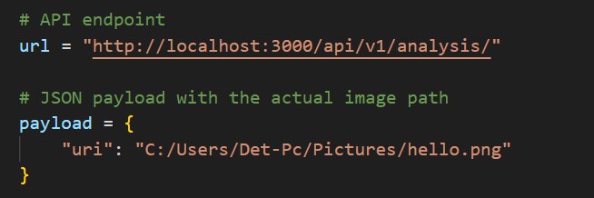
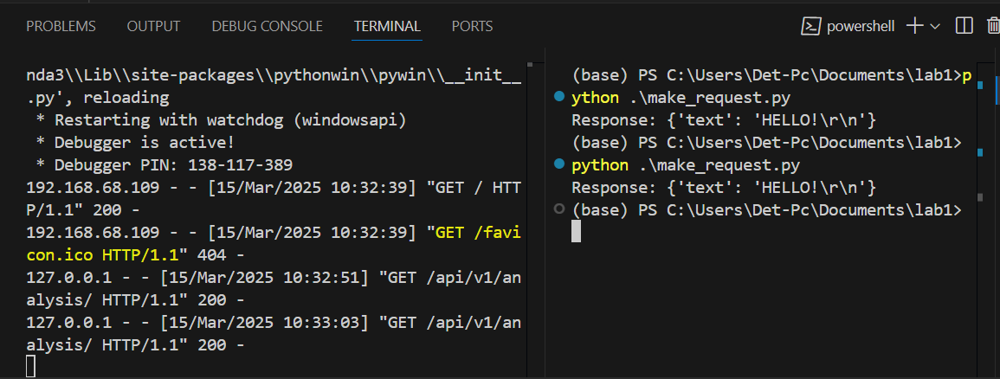

# Lab 1: Calling, Building, and Securing APIs

Este laboratorio se basa en la implementación de una aplicación web desarrollada con Flask que permite analizar imágenes y extraer el texto contenido en ellas mediante el uso de la API de OCR Space.

## Características
- Se utiliza la API de [OCR Space](https://ocr-space.translate.goog/?_x_tr_sl=en&_x_tr_tl=es&_x_tr_hl=es&_x_tr_pto=tc) para extraer texto de las imágenes enviadas.
- Despliegue de una aplicación web básica que permite interactuar con la API para analizar imágenes.
- Implementación de una función en Python que hace la solicitud de análisis de imagen.

## Despliegue
- Instalar las dependencias necesarias con el siguiente comando: `pip install -r requirements.txt`
### Iniciar el servidor Flask
Ejecutar el siguiente comando: `python app.py`.

### API de Análisis de Imágenes
- El endpoint es: `http://localhost:3000/api/v1/analysis/`
- El endpoint acepta solicitudes GET con un objeto JSON que contiene la ruta a la imagen: `C:/Users/Det-Pc/Pictures/hello.png`

### Hacer la solicitud a la API

El archivo `make_request.py` realiza la solicitud a la API de OCR Space.

Para hacer peticiones al endpoint de la API desde Python se ejecuta el siguiente comando: `python make_request.py`. El resultado es el siguiente:

Response: {'text': 'HELLO!'\r\n'} es la respuesta del modelo al extraer el texto de la imagen procesada.

