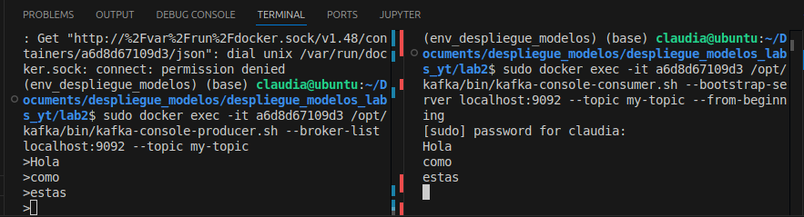
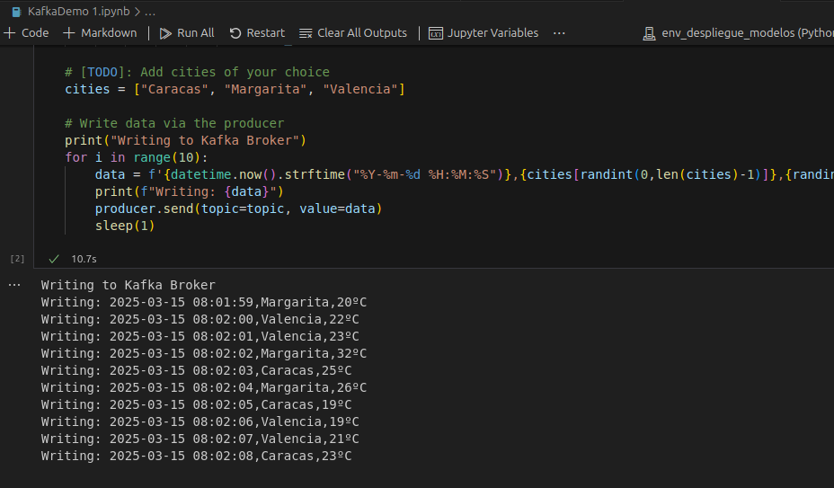
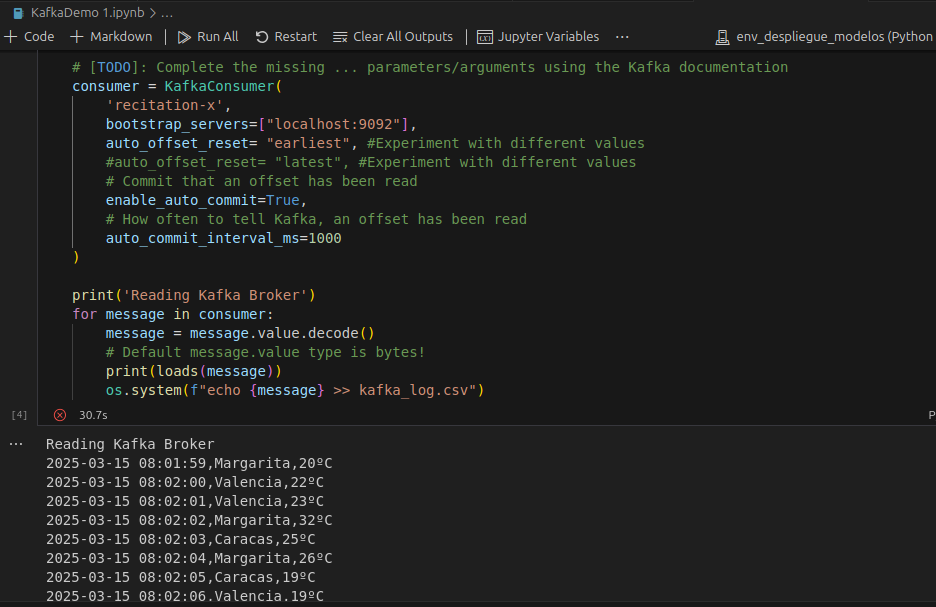
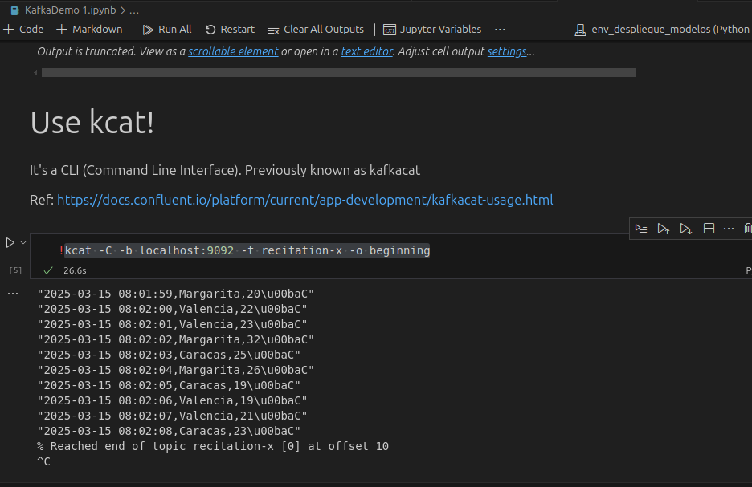

# Lab 2: Kafka for Data Streaming
Este laboratorio tiene como objetivo brindarte experiencia práctica con Apache Kafka, una plataforma de transmisión distribuida

To receive credit for this lab, show your work to the TA during recitation.

## Objetivos
- Establecer una conexión SSH segura hacia el servidor de Kafka.
- Explicar los conceptos de topic en Kafka.
- Implementar los modos de productor y consumidor para un topic.
- Demostrar el uso de la herramienta kcat.

## Implementar el Productor y el Consumidor con Docker
- Crear los Contenedores de Kafka y Zookeeper.
- Iniciar los contenedores con `docker-compose up -d`
- Producir mensajes con Docker mediante `docker exec -it <container_id_kafka> /opt/kafka/bin/kafka-console-producer.sh --broker-list localhost:9092 --topic test`. Cada línea escrita representará un mensaje que será enviado al topic test.
- Consumir mensajes con Docker mediante `docker exec -it <container_id_kafka> /opt/kafka/bin/kafka-console-consumer.sh --bootstrap-server localhost:9092 --topic test --from-beginning`. Este comando comienza a leer los mensajes del topic test.
- El resultado de esta interacción se muestra en la siguiente imagen.
  

## Implementar el Productor y el Consumidor con Python
### Productor
Encargado de enviar mensajes a un topic de Kafka.

### Consumidor 
Encargado de recibir mensajes de un topic específico y procesar los mensajes.

## Consumir Mensajes con kcat
Para consumir los mensajes del productor se debe ejecutar el siguiente comando de línea
`!kcat -C -b localhost:9092 -t recitation-x -o beginning`. Luego, se muestran los mensajes del topic recitation-x definido inicialmente.

