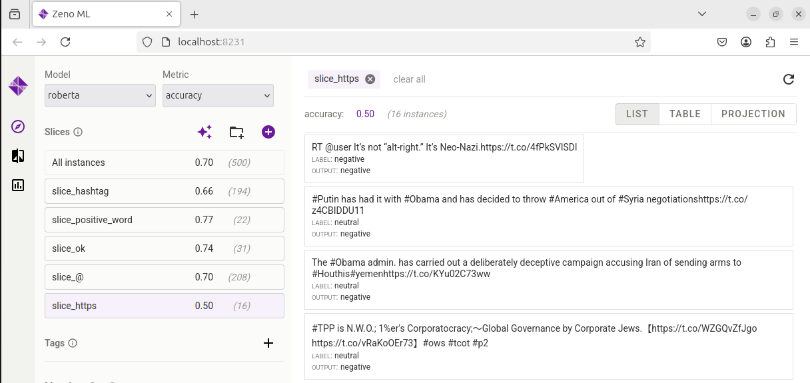

# Lab 4: Model Testing with Zeno and LLM
Este laboratorio tiene como objetivo interactuar con la plataforma Zeno para casos de prueba utilizando modelos LLM.

## Pasos generales
- Levantar el servidor local de Zeno utilizando el conjunto de datos proporcionado y generar predicciones del modelo.
- Crear 5 slices en la interfaz de Zeno y hacer observaciones significativas.
- Proponer 10 ejemplos para uno de los slices seleccionados.

## Pasos iniciales para el despliegue
- Clonar el repositorio con el siguiente comando: `git clone https://github.com/malusamayo/cmu-mlip-model-testing-lab`
- Verificar que la versión de Python sea >= 3.10.
- Instalar las siguientes librerias: `pip install zenoml datasets transformers tqdm`

## Pasos del Notebook:
- Completar los 7 pasos indicados.
- Tras ejecutar el código, accede al servidor en: [http://localhost:8231](http://localhost:8231)

Una vez ejecutado los pasos iniciales del notebook se puede evidenciar el levantamiento del servidor para el uso de la plataforma Zeno.

## Slices: Creación y Observaciones
### Slices iniciales (2) propuestos en notebook:
Utilizar la interfaz de Zeno para crear y analizar los slices propuestos, los cuales incluyen:
- Tweets con hashtags.
- Tweets con palabras positivas fuertes (por ejemplo, amor). En este caso se utilizo la palabra like. 

Los slices generados en la plataforma Zeno reflejan como cambia el rendimiento del modelo seleccionado, en este caso 'roberta', acorde a la subdivisión de datos realizada con cada slice.

### Propuesta de 3 slices adicionales:
Diseñar tres ideas adicionales para divisiones de datos que complemente el análisis anterior.

Estos slices seleccionados fueron en base a elementos comunes que contienen los tweets, por lo que se asume pudieran tener algún impacto en el rendimiento del modelo si se seleccionan.

### Propuesta de 3 slices con distinto contexto al de los tweets dados:
Diseñar tres ideas hipotéticas para divisiones de datos adicionales con algún contexto adicional al de los datos proporcionados. 

Estos contextos pueden ayudar a desglosar de diferentes maneras tweets acorde a contextos específicos. 

### Generación de casos adicionales:
Usar LLMs para generar 10 ejemplos representativos en base a uno de los slices anteriores. Para este ejemplo, se selecciono el tercer slice que se refiere a tweets con sarcasmo y humor. 

