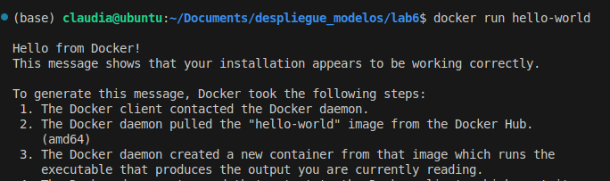
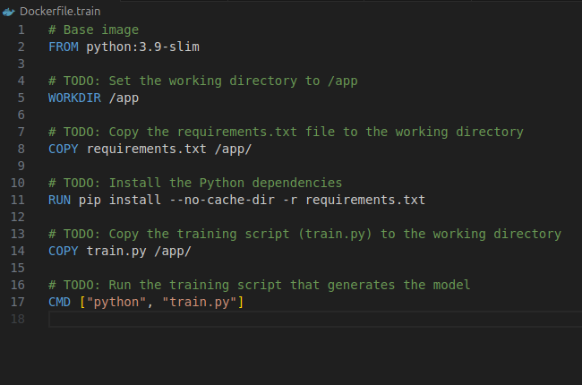
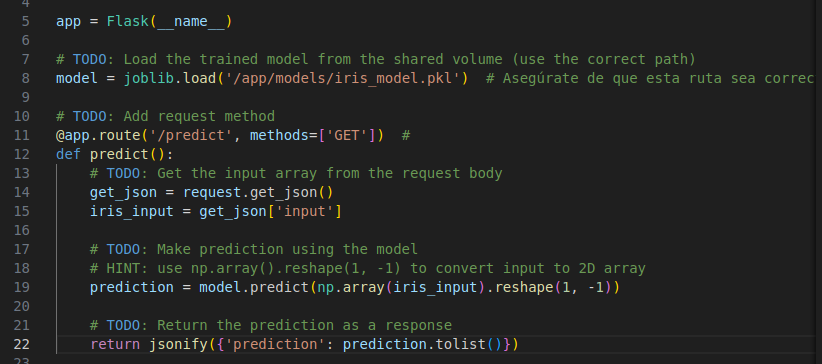
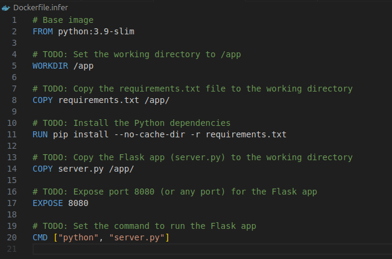
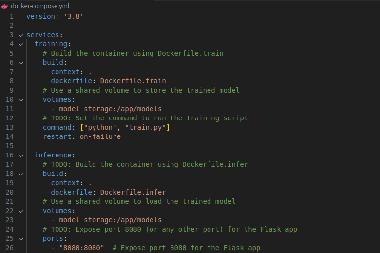
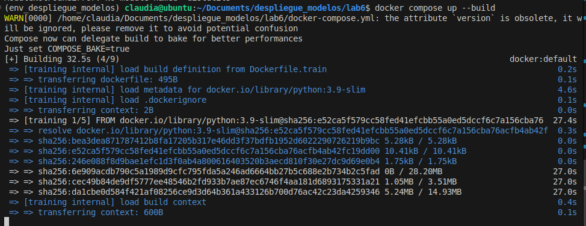
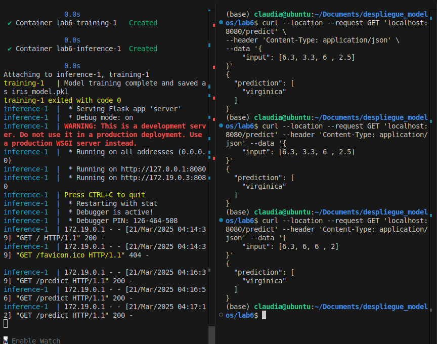

# Lab 5: Containerizing with Docker
El objetivo del presente laboratorio es containerizar una aplicacion Flask y desplegar un modelo de ML utilizando Docker y Docker Compose.

## 1. Configuración Inicial de Docker:
- Instalar Docker en el sistema.
- Verificar la instalación ejecutando el siguiente comando: `docker run hello-world`



## 2. Containerización del Entrenamiento del Modelo:
Completar el archivo `Dockerfile.train`:
- Copiar `requirements.txt` e instalar las dependencias.
- Copiar `train.py` al directorio de trabajo.
- Establecer el comando para ejecutar train.py: `CMD ["python", "train.py"]`



## 3. Containerización de la Aplicación Flask para Inferencia:
### Modifica `server.py` con lo siguiente:
- Cargar el modelo entrenado.
- Procesar datos de entrada enviados por una solicitud GET.
- Devolver la predicción como respuesta.



### Completar Dockerfile.infer:
- Establecer el directorio de trabajo /app.
- Copiar `requirements.txt` y `server.py`
- Exponer el puerto 8080.



## 4. Configuración de Docker Compose
### Definir los servicios en el archivo `docker-compose.yml`
- Usar `Dockerfile.train` para entrenar el modelo.
- Usar `Dockerfile.infer` para realizar las predicciones.



## 5. Ejecución del Proyecto
- Construir y ejecutar el Docker Compose: `docker-compose up --build`



## 6. Prueba de la API de Predicción
- Realizar una solicitud GET para pobar en endpoint:
```
curl --location --request GET 'localhost:8080/predict' \
--header 'Content-Type: application/json' \
--data '{
    "input": [6.3, 3.3, 6, 2.5]
}'

```

- Los resultados se muestran a continuación:



Del lado derecho de la imagen se puede apreciar como dado un conjunto de valores el modelo es capaz de retornar la prediccion de la clase.
