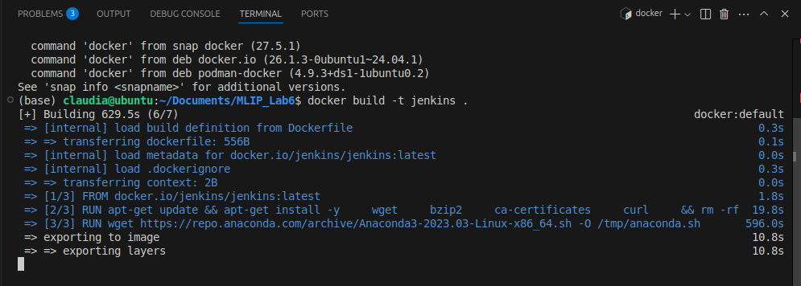
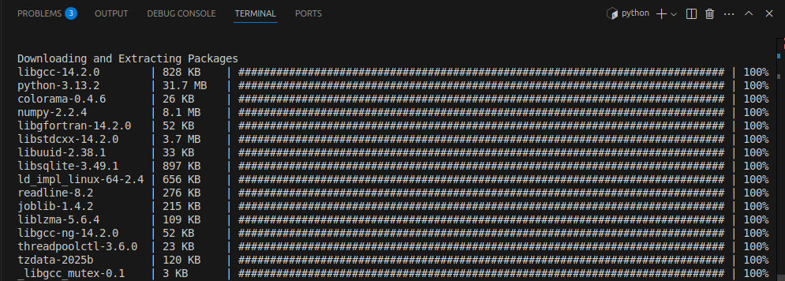
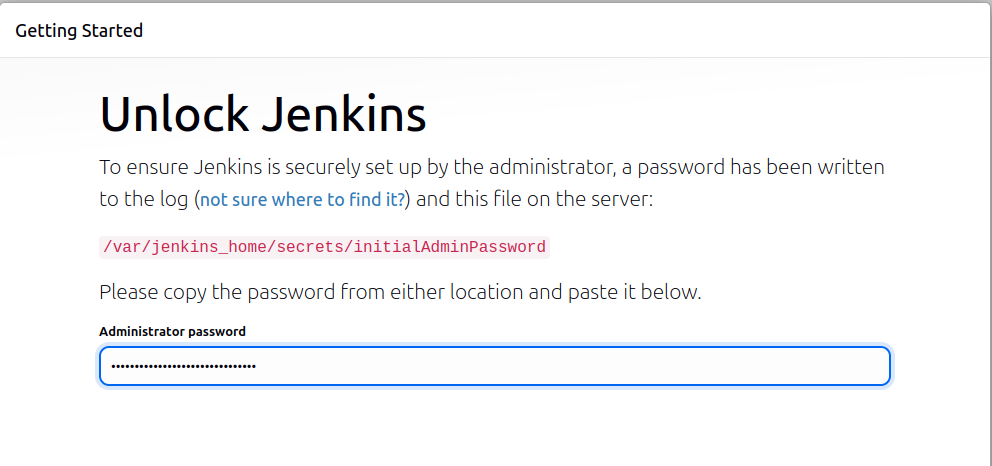
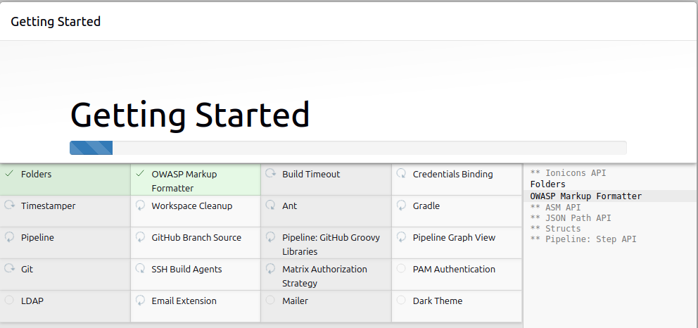
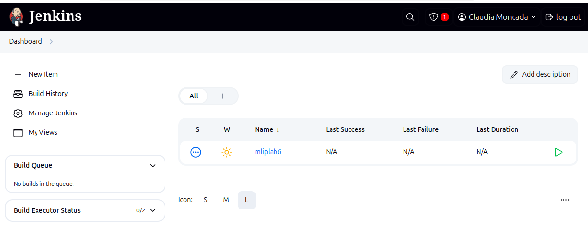
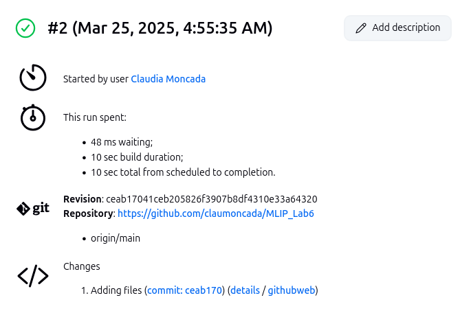
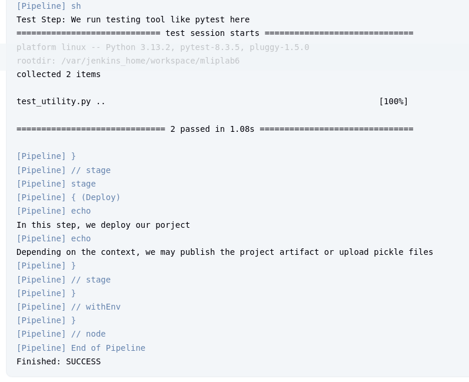

# Lab 6: Continuous Integration with Jenkins
En este laboratorio se explora la implementación de Integración Continua (CI) utilizando Jenkins.

## Configuración inicial
### Descarga e Inicio de Jenkins con Docker

- Descargar la imagen oficial: `docker pull jenkins/jenkins:latest`
- Crear y ejecutar un Docker para Jenkins: `docker run -d -p 8080:8080 -p 50000:50000 --name jenkins-container -v jenkins_home:/var/jenkins_home jenkins/jenkins:latest`
- Verficar: `docker ps`

### Crear el Ambiente Virtual
- Conda: `conda create -n mlip python pytest numpy pandas scikit-learn -c conda-forge`

### Configuración del repositorio
- Realizar un fork del repositorio en GitHub: `https://github.com/pedrogbmendes/MLIP_Lab6/`
- Clonar el fork en nuestra máquina local.

## Configuracion del pipeline en Jenkins:
- Abrir el dashboard de Jenkins: `http://localhost:8080`
- Hacer click en `+ New Item` y crear un proyecto tipo Pipeline llamado `mliplab6`.
- En la sección General:
Activar la opcion GitHub Project y proporcionar la URL del repositorio.

- En la sección Pipeline:
- Seleccionar Pipeline Script from SCM.
- Configurar las credenciales con el token de acceso personal.
- Cambiar el nombre de la rama a `main`

## Pruebas con Pytest
- Ejecutar `pytest` en el directorio raiz y observar el error de prueba.
- Modificar la seccion `TODO` en el archivo `test_utility.py`.
- Ejecutar nuevamente `pytest` y verificar la ejecución de las pruebas.
- Hacer push al repositorio de GitHub.

## Modificación del archivo Jenkinsfile
- Completar la sección `TODO` para que se ejecute pytest durante cada ejecución.
- Hacer push con los cambios al repositorio de GitHub.

## Ejecución en Jenkins exitosa

