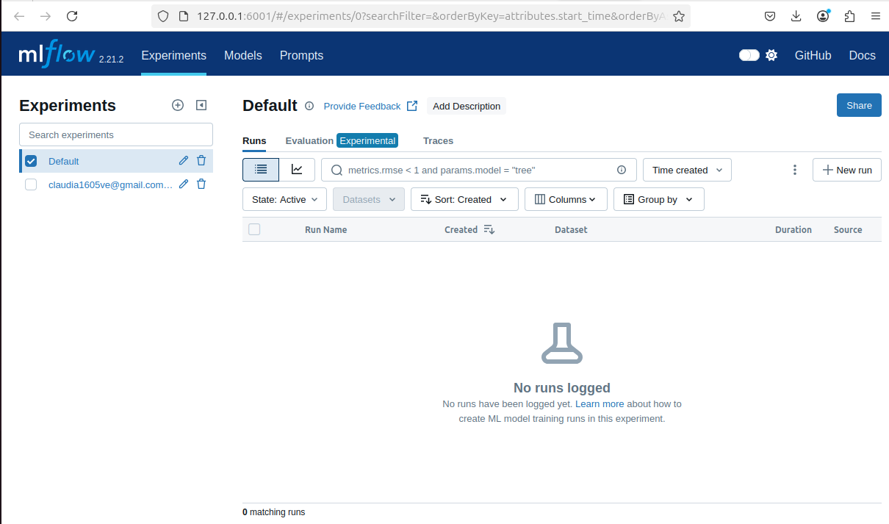
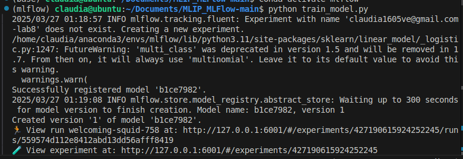
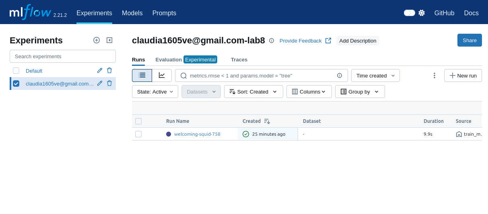
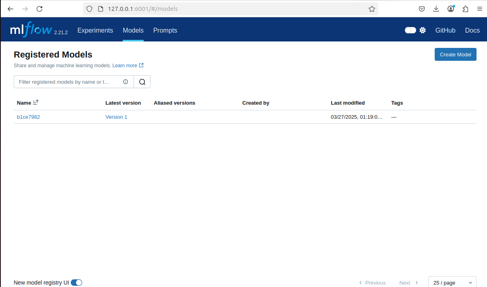
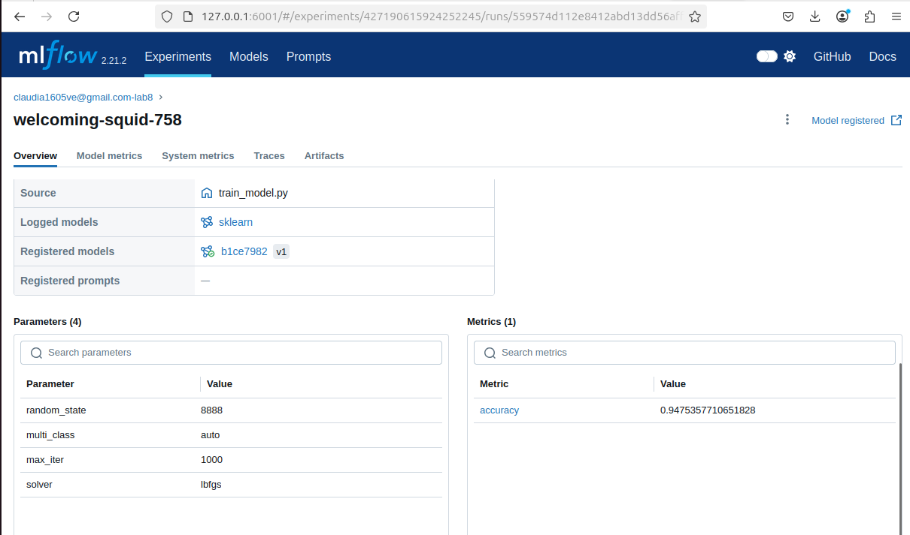
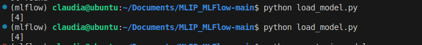
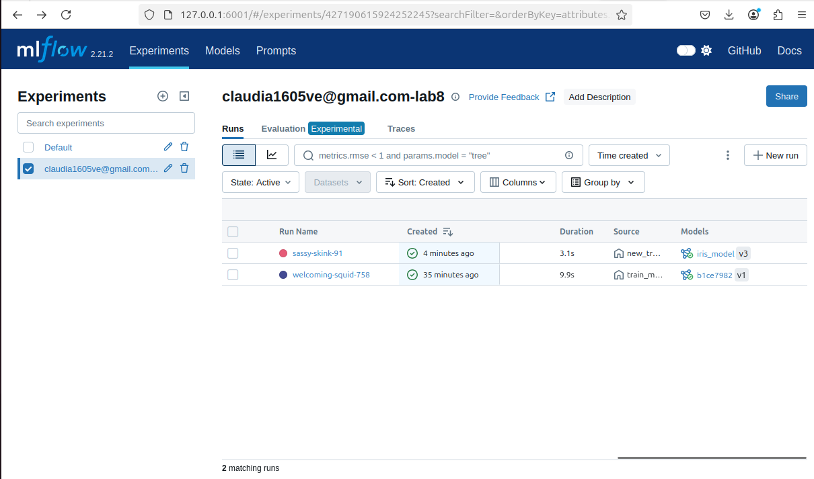
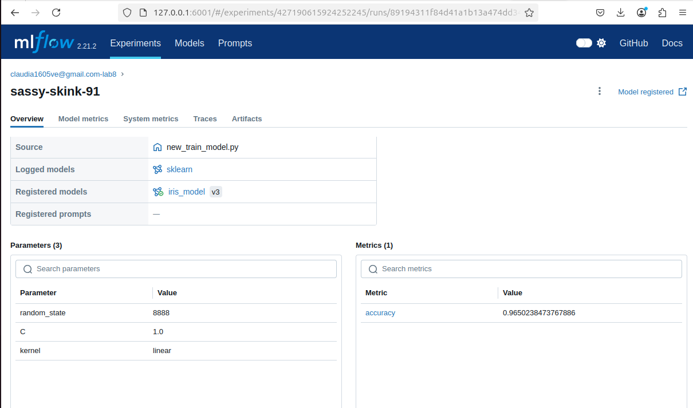

# Lab 8: Manage ML Projects with MLFlow
En este laboratorio de utiliza MLFlow para gestionar y monitorear nuestros proyectos de machine learning.

## Configuración del servidor local de MLFlow
- Clonar el repositorio de GitHub: `https://github.com/Rajeevveera24/MLIP_MLFlow`
- Instalar mlflow: `pip install mlflow`
- Iniciar el servidor local: `mlflow server --host 127.0.0.1 --port 6001`
- Verificar que el servidor este funcionando en: `http://127.0.0.1:6001`

## Completar `train_model.py` (Deliverable 1)
- Extraer los conjuntos de train y test: `pipeline.data_preprocessing()`
- Entrenar el modelo de regresión logística: `pipeline.train_logistic_regression()`
- Evaluar el modelo: `pipeline.evaluation()`
- Ejecutar `train_model.py` para tener un primer entrenamiento del modelo de regresión logística.

## Completar `load_model.py` (Deliverable 2)
- Asignar el URI del servidor local de MLFlow: `http://127.0.0.1:6001`
- Cargar el modelo de regresión logística y realizar predicciones ejecutando `load_model.py`

## Actualizar y registrar una nueva versión del modelo (Deliverable 3)
- Elección del nuevo algoritmo: SVM
- Script para entrenamiento del nuevo modelo SVM: `new_train_model.py`
- Registro del nuevo modelo en MLFlow:

- Realizar una predicción sobre el nuevo modelo: `new_load_model.py`

En vista de que el problema inicial se basa en realizar clasificación, se selecciono el algoritmo SVM por su capacidad de separar las clases de datos para diferentes distribuciones.
