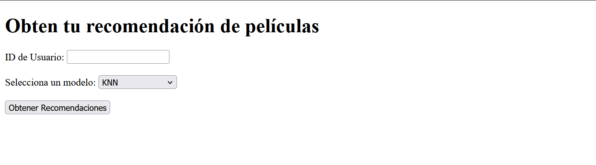
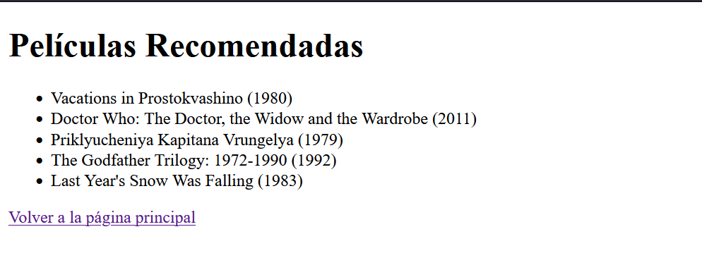

# Midterm: Movie Recommendation System
Este proyecto implementa un sistema de recomendación de películas utilizando dos algoritmos de aprendizaje automático: K-Nearest Neighbors (KNN) y Regresión Lineal. El sistema permite predecir las calificaciones que un usuario le daría a una película basada en las calificaciones previas de otros usuarios.

## Algoritmos Implementados:
- KNN: El algoritmo utiliza las calificaciones de los vecinos más cercanos (usuarios similares) para predecir una calificación. 

- Regresión Lineal: El modelo encuentra una relación lineal entre las características (calificaciones de otras películas) y la calificación que queremos predecir.

## Estructura del Proyecto:
- `entrenamiento.py`: Script para entrenar los modelos de KNN y regresión lineal. Guarda los modelos y las métricas de rendimiento en archivos.
- `app.py`: Archivo de la aplicación Flask que sirve la interfaz web donde los usuarios pueden obtener recomendaciones.
- `models/`: Carpeta donde se guardan los modelos entrenados y las métricas.
- `movies.csv`: Datos de las películas (incluye movieId y title).
- `ratings.csv`: Datos de las calificaciones de los usuarios.
- `templates/`: Carpeta con las plantillas HTML utilizadas en la aplicación web.

## Usar la Aplicación Web:
Permite a los usuarios ingresar su ID para que el sistema ofrezca recomendaciones de peliculas.

- Ejecutar el siguiente comando en la terminal para iniciar el servidor Flask: `python app.py`
- Esto arrancará la aplicación web en `http://127.0.0.1:5000/.`
- En la página principal, ingresar el ID de usuario (por ejemplo, 1, 2, 3, etc.).

- Seleccionar el modelo que se desea usar (KNN o Regresión Lineal).
- Hacer clic en Obtener Recomendaciones.
- La aplicación mostrará una lista de películas recomendadas para el ID de usuario basado en el modelo seleccionado.

